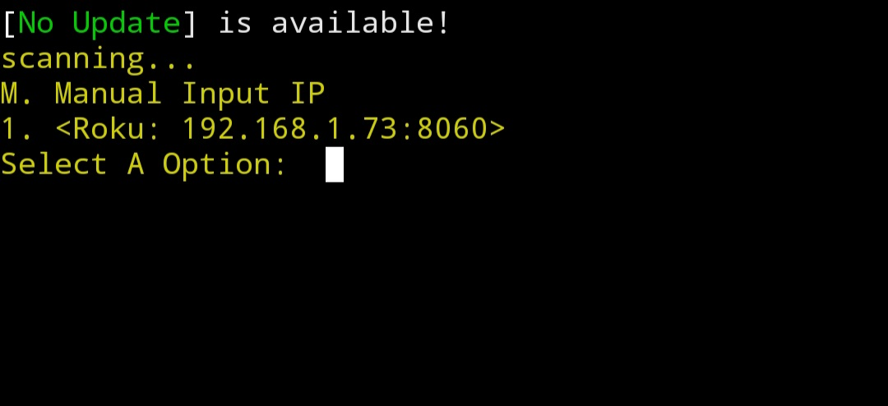

## RoJaker

This is a python script that allows you to scan for roku devices on your router and allows you to control them 

## Supported
* Working (✅️), Bugs but works (⚠️), Doesn't work (🚫)

> * Windows ⚠️

> * Linux   ✅️

> * Mac OS   ✅️

> * Termux (No Root) ✅️

> * IOS (Checkra1n & palera1n)  ⚠️

## Set up for Linux and Termux
* `git clone https://github.com/RE70-DECEMBER/RoJaker.git`
* `cd RoJaker` 
* `pip3 install requests`
* `chmod +x *`
* `python3 config.py`
* `python3 rojaker.py`

## Rojaker features
* Check for updates 
* remote
* menu color select
* module checker
* dump Apps
* run a app
* power on or off TV
* scan for roku tvs
* Change color of menu

## RoJaker Update

**JUNE 18TH, 2024**
* Check TV for developer mode (added)

* volume all the way up/down (added)

* figlet banner (removed)

* ascii art (added)

**MARCH 6TH, 2024**
* Check for updates (added)
* remote (added)
* Menu color select (added)

**FEBRUARY 28TH, 2024**

* Check TV Up time (removed)

**FEBRUARY 19TH, 2024**
* Dump Apps (added)
* Run a app (added)
* Check TV Up Time (added)
* Power on/off TV (added)

 **FEBRUARY 11TH, 2024**
* pip-module-checker(added)
* Menu Border(fixed) 

  **FEBRUARY 3RD, 2024**
* Scan for roku tvs (added)
* Manuel ip selection (added)
* goback to menu (added)

## bugs

*trying to return to main menu after using remote menu nothing works and script wont let you exit without pressing ctrl+c and enter

## requirments

* python3 (auto linux, man termux
* pip3 (auto linux, windows, termux man)
* colorma (script auto download)
* roku (script auto download)
* figlet (comes auto on Linux, man install needed windows, termux)

**how to use**

python3 rojaker.py

**Note**

* you will be prompted to install the requirments you need when you start the script, I made it where if you don't have the requirments it'll install them for you when you run the rojaker.py script, so you won't have a requirments.txt anymore because that's inconvenient to a unexpericed user using the command-line, so basically no need to do (pip3 install -r requirements.txt) on this script, requirments.txt ain't there anyways 
