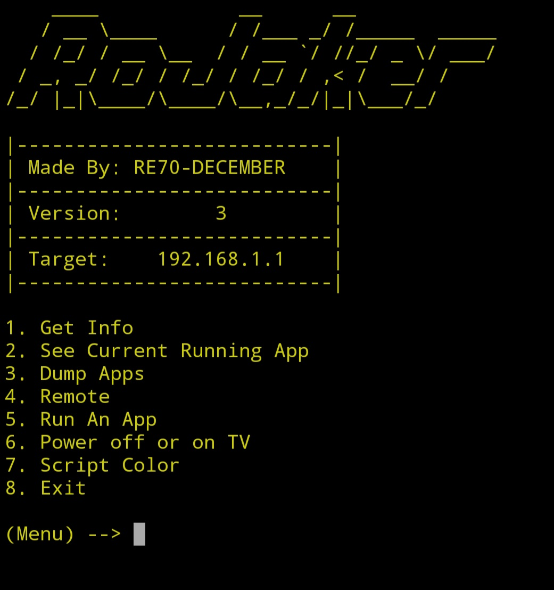

**RoJaker**

This is a python script that allows you to scan for roku devices on your router and allows you to control them 

**Basic setup** 

''

cd RoJaker 
test

''

**Rojaker Info**

I will constantly update this script it's a work in progress and it works so far except for the dump Apps and run app and the remote doesn't work right now but you can see what app is currently running on the device. update and improvements will constantly be applied so feel free to look at this github repository to see if any improvements or updates have been made 

**Rojaker features**
* Check for updates 
* remote
* menu color select
* module checker
* dump Apps
* run a app
* power on or off TV
* scan for roku tvs 

**RoJaker Update**

**MARCH 6TH, 2024**
* Check for updates (added)
* remote (added)
* Menu color select (added)

**FEBRUARY 28TH, 2024**

*Check TV Up time (removed)

**FEBRUARY 19TH, 2024**
* Dump Apps (added)
* Run a app (added)
* Check TV Up Time (added)
* Power on/off TV (added)

 **FEBRUARY 11TH, 2024**
* pip-module-checker(added)
* Menu Border(fixed) 

  **FEBRUARY 3RD, 2024**
* Scan for roku tvs (added)
* Manuel ip selection (added)
* goback to menu (added)

**bugs**

*trying to return to main menu after using remote menu nothing works and script wont let you exit without pressing ctrl+c and enter

**requirments**

*python3
*pip3

**how to use**

python3 rojaker.py

**Note**

* you will be prompted to install the requirments you need when you start the script, I made it where if you don't have the requirments it'll install them for you when you run the rojaker.py script, so you won't have a requirments.txt anymore because that's inconvenient to a unexpericed user using the command-line, so basically no need to do (pip3 install -r requirements.txt) on this script, requirments.txt ain't there anyways 
